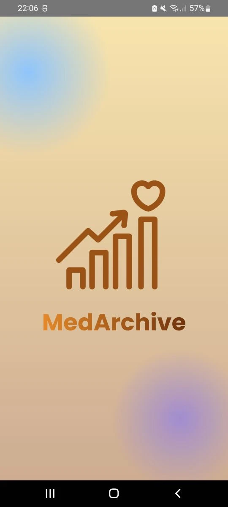
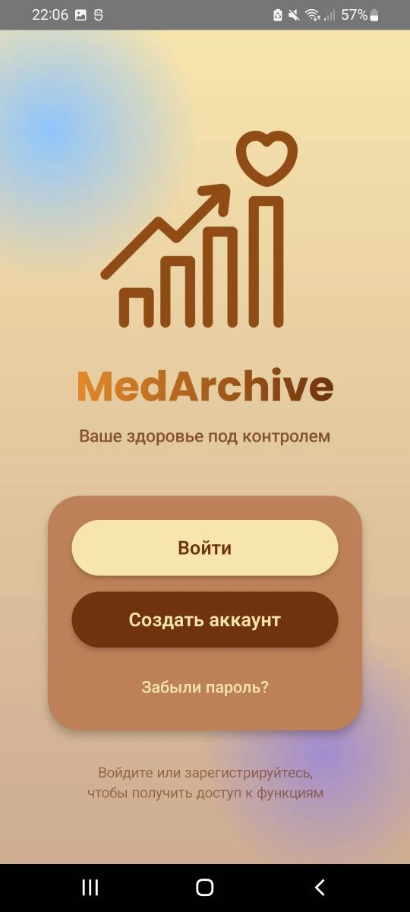
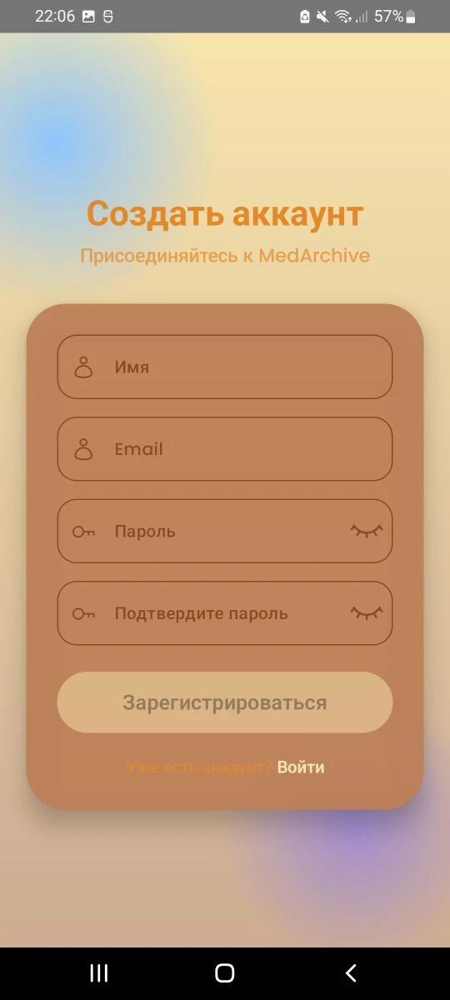
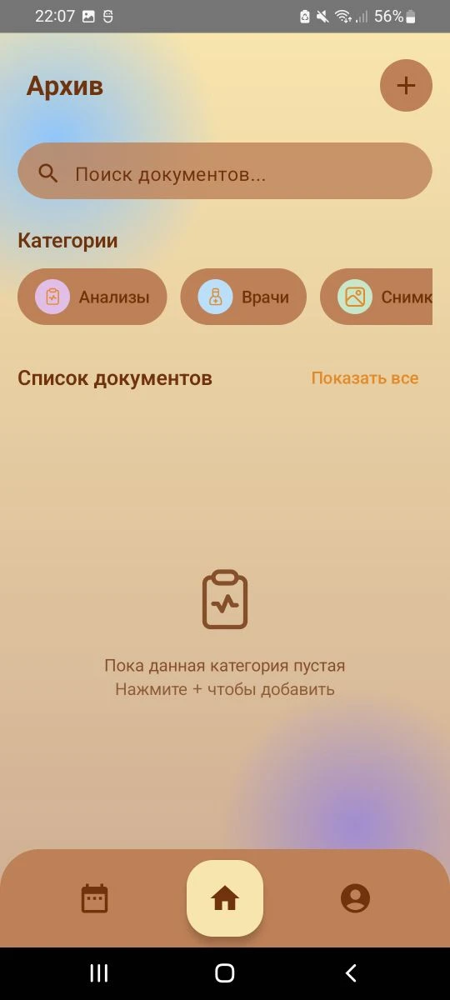
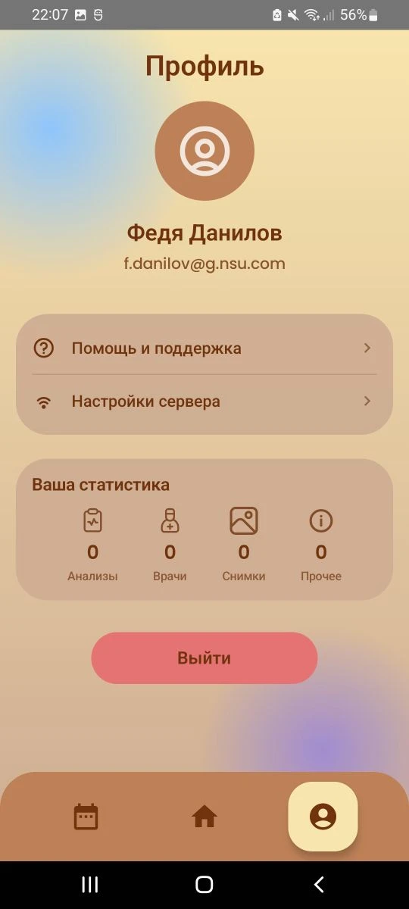
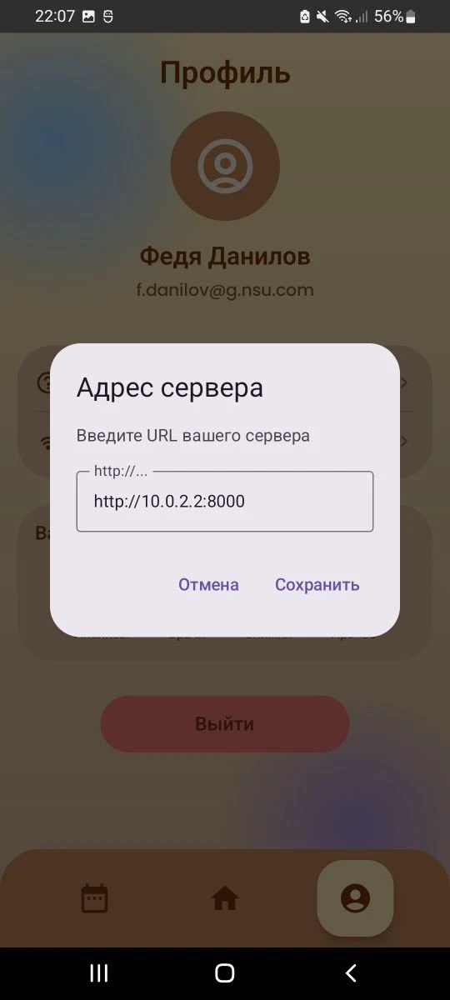
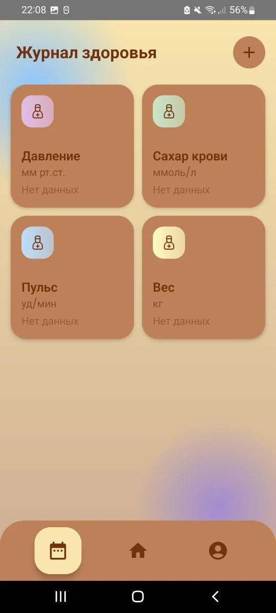

# 📚 MedArchive

**MedArchive** — мобильное приложение для хранения медицинских данных и отслеживания показателей здоровья в динамике.

Приложение позволяет:

* 📁 хранить медицинские документы
* 📊 отслеживать показатели (давление, пульс, вес и др.)
* 🧠 вести персональный журнал здоровья

---

# 🚀 Быстрый старт (очень важно пройти все шаги)
## 1. 📱 Запуск приложения

Установи файл:

```
MedArchive.apk
```

на свой Android телефон.

## 2. Включите VPN

## Приложением можно пользоваться

## 📸 Визуал

<p align="center">
  
  
</p>

<p align="center">
  
  
</p>

<p align="center">
  
  
</p>

<p align="center">
  
  
</p>

<p align="center">
  
  
</p>

---

# 📊 Основные возможности

## 🧾 Медицинский архив

* хранение записей
* структурированные данные

## 📈 Журнал здоровья

* отслеживание показателей
* отображение последних значений
* категории (давление, вес, пульс и т.д.)

## 🧠 Умная система категорий

* кастомные показатели
* цветовые карточки
* быстрый доступ к данным

---

# 🧠 Идея проекта

MedArchive — это инструмент для **долгосрочного контроля здоровья**, который объединяет:

* медицинский архив
* ежедневный мониторинг
* персональную аналитику

---
